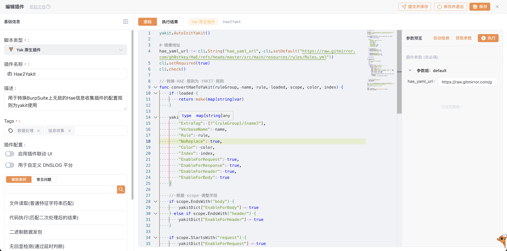

# Hae2Yakit

用于转换 BurpSuite 平台中无敌的Hae信息收集插件的配置规则为yakit使用，减少因为插件不支持而无法脱离burp的烦恼

## 使用方法

### 1 安装插件

在 yakit 的插件仓库中搜索关键词 hae2yakit

(如果商店搜不到可以新建插件导入)

### 2 运行插件

### 3 导入配置

## 参考项目

[https://github.com/MZgoudan/hae-yakit](https://github.com/MZgoudan/hae-yakit)